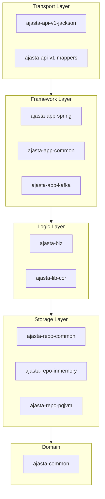
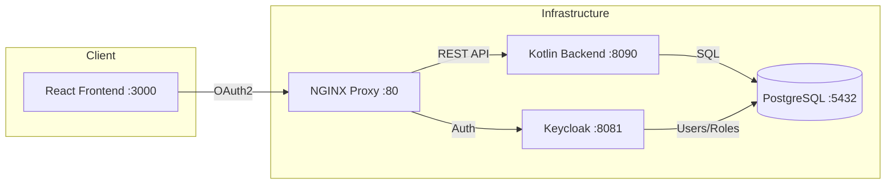

# Agenda

- Project Overview and Architecture
- Transport Module (API Layer)
- Framework Module (Application Layer)
- Logic Module (Business Layer)
- Storage Module (Data Layer)
- Testing Infrastructure
- Monitoring and Observability
- Working Application Demonstration
- Summary and Requirements Fulfillment

# Project Overview

**Technology Stack:**
- Kotlin 1.9+ with Coroutines
- Spring Boot 3.x Framework
- PostgreSQL 16 with Exposed ORM
- Keycloak Authentication (OAuth2/OIDC)
- Docker/Podman Containerization

**Key Features:**
- Resource booking with time slots
- Availability management
- Role-Based Access Control (RBAC)
- Multi-tenant resource ownership

# Modular Architecture



# Module Structure (16 Gradle Modules)

| Layer | Modules |
|-------|---------|
| Transport | `ajasta-api-v1-jackson`, `ajasta-api-v1-mappers` |
| Framework | `ajasta-app-spring`, `ajasta-app-common`, `ajasta-app-kafka` |
| Logic | `ajasta-biz`, `ajasta-lib-cor` |
| Storage | `ajasta-repo-common`, `ajasta-repo-inmemory`, `ajasta-repo-pgjvm` |
| Domain | `ajasta-common` |
| Testing | `ajasta-stubs`, `ajasta-repo-tests-*` |

# Transport Module — Overview

**Purpose:** External API communication, JSON serialization, DTO mapping

**Key Components:**
- 46 auto-generated API DTOs
- Jackson ObjectMapper configuration
- Bidirectional mappers (DTO ↔ Domain)

**Code References:**
- `ajasta-api-v1-jackson/src/main/kotlin/top/ajasta/api/v1/ApiV1Mapper.kt`
- `ajasta-api-v1-jackson/build/generate-resources/.../models/`

# Transport Module — API DTOs

Request/Response pairs for all operations:

```text
BookingCreateRequest/Response
BookingReadRequest/Response
BookingUpdateRequest/Response
BookingDeleteRequest/Response
BookingSearchRequest/Response

ResourceCreateRequest/Response
ResourceReadRequest/Response
ResourceUpdateRequest/Response
ResourceDeleteRequest/Response
ResourceSearchRequest/Response
AvailabilityRequest/Response
```

# Transport Module — Mappers

**File:** `ajasta-api-v1-mappers/src/main/kotlin/top/ajasta/api/v1/mappers/FromTransportMappers.kt`

```kotlin
// Maps API requests to internal context
fun BookingCreateRequest.toContext(): BizContext = BizContext(...).apply {
    command = AjastaCommand.BOOKING_CREATE
    bookingRequest = booking.toInternal()
    // ...
}
```

**File:** `ajasta-api-v1-mappers/src/main/kotlin/top/ajasta/api/v1/mappers/ToTransportMappers.kt`

```kotlin
// Maps internal context to API responses
fun BizContext.toResponse(): BookingCreateResponse = BookingCreateResponse(
    response = ResponseResult.SUCCESS,
    booking = bookingResponse?.toTransport()
)
```

# Framework Module — Spring Boot

**File:** `ajasta-app-spring/src/main/kotlin/top/ajasta/app/spring/Application.kt`

```kotlin
@SpringBootApplication
class Application

fun main(args: Array<String>) {
    runApplication<Application>(*args)
}
```

**Configuration:** `ajasta-app-spring/src/main/resources/application.yaml`

- Server port: 8080
- Jackson: camelCase, non_null inclusion
- Management: health, info, metrics endpoints
- Swagger UI: /swagger-ui.html

# Framework Module — Controllers

**File:** `ajasta-app-spring/src/main/kotlin/top/ajasta/app/spring/controllers/BookingControllerV1.kt`

```kotlin
@RestController
@RequestMapping("/v1/bookings")
class BookingControllerV1(private val processor: AjastaProcessor) {

    @PostMapping("/create")
    suspend fun create(@RequestBody request: BookingCreateRequest) =
        processor.exec(request.toContext()).toResponse()

    @PostMapping("/search")
    suspend fun search(@RequestBody request: BookingSearchRequest) =
        processor.exec(request.toContext()).toResponse()
}
```

# Framework Module — Configuration

**File:** `ajasta-app-spring/src/main/kotlin/top/ajasta/app/spring/config/AppConfig.kt`

```kotlin
@Configuration
@Profile("prod")
class ProdConfig {
    @Bean
    fun repoBooking(repo: RepoBookingSql): IRepoBooking = repo

    @Bean
    fun repoResource(repo: RepoResourceSql): IRepoResource = repo
}

@Configuration
@Profile("dev")
class DevConfig {
    @Bean
    fun repoBooking(): IRepoBooking = RepoBookingInMemory()

    @Bean
    fun repoResource(): IRepoResource = RepoResourceInMemory()
}
```

# Logic Module — Chain of Responsibility

**File:** `ajasta-lib-cor/src/commonMain/kotlin/top/ajasta/lib/cor/corDsl.kt`

Custom coroutine-based execution framework with DSL:

```kotlin
rootChain<BizContext> {
    worker("Initialize status") { status = AjastaState.RUNNING }

    chain("Validation") {
        worker("Validate ID") { if (bookingId.isNullOrBlank()) fail("ID required") }
        worker("Validate title") { if (title.isNullOrBlank()) fail("Title required") }
    }

    chain("Repository") {
        worker("Read from DB") { bookingResponse = repo.read(this) }
    }

    worker("Prepare result") { status = AjastaState.FINISHING }
}.exec(context)
```

# Logic Module — Business Processor

**File:** `ajasta-biz/src/commonMain/kotlin/top/ajasta/biz/AjastaProcessor.kt`

```kotlin
class AjastaProcessor(
    private val repoBooking: IRepoBooking,
    private val repoResource: IRepoResource
) {
    private val bookingChain = rootChain<BizContext> {
        initStatus("Booking initialization")
        operation("Booking CRUD operations", AjastaCommand.BOOKING_CREATE) {
            validationChain()
            repoBookingChain()
            prepareResult()
        }
        // ... BOOKING_READ, UPDATE, DELETE, SEARCH
    }.build()

    suspend fun exec(ctx: BizContext) = bookingChain.exec(ctx)
}
```

# Logic Module — Validation Workers

**Location:** `ajasta-biz/src/commonMain/kotlin/top/ajasta/biz/validation/`

| Validator | Purpose |
|-----------|---------|
| `ValidateBookingIdFormat.kt` | UUID format validation |
| `ValidateBookingTitleNotEmpty.kt` | Title presence check |
| `ValidateBookingTitleLength.kt` | Title length limits |
| `ValidateResourcePricePositive.kt` | Price must be positive |
| `ValidateSlotsNotEmpty.kt` | Slots presence check |
| `ValidateAvailabilityDateRange.kt` | Date range validation |

# Storage Module — Repository Interfaces

**File:** `ajasta-repo-common/src/commonMain/kotlin/top/ajasta/repo/IRepoBooking.kt`

```kotlin
interface IRepoBooking {
    suspend fun createBooking(request: DbBookingRequest): IDbBookingResponse
    suspend fun readBooking(request: DbBookingIdRequest): IDbBookingResponse
    suspend fun updateBooking(request: DbBookingRequest): IDbBookingResponse
    suspend fun deleteBooking(request: DbBookingIdRequest): IDbBookingResponse
    suspend fun searchBookings(request: DbBookingFilterRequest): IDbBookingsResponse
}
```

# Storage Module — In-Memory Repository

**File:** `ajasta-repo-inmemory/src/commonMain/kotlin/top/ajasta/repo/inmemory/RepoBookingInMemory.kt`

```kotlin
class RepoBookingInMemory : IRepoBooking {
    private val storage = mutableMapOf<AjastaBookingId, AjastaBooking>()
    private val mutex = Mutex()

    override suspend fun createBooking(request: DbBookingRequest): IDbBookingResponse {
        mutex.withLock {
            val booking = request.booking.copy(lock = AjastaLock(randomUUID()))
            storage[booking.id] = booking
            return DbBookingResponseOk(booking)
        }
    }
}
```

# Storage Module — PostgreSQL Repository

**File:** `ajasta-repo-pgjvm/src/main/kotlin/top/ajasta/repo/pg/RepoBookingSql.kt`

```kotlin
class RepoBookingSql : IRepoBooking {
    override suspend fun createBooking(request: DbBookingRequest): IDbBookingResponse =
        transaction {
            val table = BookingTable
            val id = table.insert {
                it[id] = request.booking.id.asString()
                it[resourceId] = request.booking.resourceId.asString()
                it[title] = request.booking.title
                it[status] = request.booking.status.name
            } get table.id
            readBookingById(id)
        }
}
```

# Storage Module — Domain Models

**Location:** `ajasta-common/src/jvmMain/kotlin/top/ajasta/common/models/`

```kotlin
// Value Objects for type safety
@JvmInline value class AjastaBookingId(val id: String)
@JvmInline value class AjastaResourceId(val id: String)
@JvmInline value class AjastaUserId(val id: String)
@JvmInline value class AjastaLock(val lock: String)

// Entities
data class AjastaBooking(
    val id: AjastaBookingId = AjastaBookingId.NONE,
    val resourceId: AjastaResourceId = AjastaResourceId.NONE,
    val title: String = "",
    val description: String = "",
    val slots: List<AjastaSlot> = emptyList(),
    val status: AjastaBookingStatus = AjastaBookingStatus.NEW,
    val lock: AjastaLock = AjastaLock.NONE
)
```

# Tests — Overview

**Total Test Files:** 90+ across all modules

| Category | Test Count |
|----------|------------|
| API Serialization | 46 DTO tests |
| Mapper Tests | 4 tests |
| Business Logic | 5 tests |
| COR Framework | 3 tests |
| Repository Tests | 25+ tests |
| Controller Tests | 2 tests |
| Kafka Tests | 2 tests |

# Tests — Repository Tests

**Location:** `ajasta-repo-tests-booking/`, `ajasta-repo-tests-resource/`

Common test suite for all repository implementations:

```text
ajasta-repo-tests-booking/
├── RepoBookingCreateTest.kt
├── RepoBookingReadTest.kt
├── RepoBookingUpdateTest.kt
├── RepoBookingDeleteTest.kt
├── RepoBookingSearchTest.kt
└── RunRepoTest.kt
```

Tests run against both InMemory and PostgreSQL implementations.

# Tests — Business Logic Tests

**Location:** `ajasta-biz/src/commonTest/kotlin/top/ajasta/biz/`

```kotlin
class BookingValidationTest {
    @Test
    fun `validation fails with empty title`() = runTest {
        val ctx = BizContext().apply {
            command = AjastaCommand.BOOKING_CREATE
            bookingRequest = AjastaBooking(title = "")
        }
        processor.exec(ctx)
        assertFalse(ctx.errors.isEmpty())
    }
}
```

# Tests — Running Tests

```bash
# Run all JVM tests
./gradlew jvmTest

# Run specific module
./gradlew :ajasta-biz:jvmTest
./gradlew :ajasta-repo-pgjvm:test

# Run with coverage
./gradlew jvmTest jacocoTestReport
```

# Monitor — Spring Boot Actuator

**Configuration:** `ajasta-app-spring/src/main/resources/application.yaml`

```yaml
management:
  endpoints:
    web:
      exposure:
        include: health,info,metrics
```

**Available Endpoints:**

| Endpoint | URL | Purpose |
|----------|-----|---------|
| Health | `/actuator/health` | Application health status |
| Info | `/actuator/info` | Application metadata |
| Metrics | `/actuator/metrics` | JVM & HTTP metrics |
| Swagger | `/swagger-ui.html` | API documentation |
| OpenAPI | `/api-docs` | API specification |

# Monitor — Health Check Example

```bash
curl http://localhost:8090/actuator/health
```

```json
{
  "status": "UP",
  "components": {
    "db": { "status": "UP" },
    "diskSpace": { "status": "UP" }
  }
}
```

# Demonstration — System Architecture



# Demonstration — Docker Compose Services

**File:** `docker-compose.kotlin.yml`

| Service | Image | Port | Purpose |
|---------|-------|------|---------|
| `ajasta-kotlin-backend` | Custom | 8090 | Kotlin API |
| `ajasta-frontend` | Custom | 3000 | React UI |
| `ajasta-db` | postgres:16 | 5432 | Database |
| `ajasta-keycloak` | keycloak | 8081 | Auth Server |
| `ajasta-nginx` | nginx | 80 | Reverse Proxy |

# Demonstration — API Examples

**Search Resources:**

```bash
curl -X POST http://localhost:8090/v1/resources/search \
  -H "Content-Type: application/json" \
  -d '{"requestType":"searchResources","resourceFilter":{}}'
```

**Create Booking:**

```bash
curl -X POST http://localhost:8090/v1/bookings/create \
  -H "Content-Type: application/json" \
  -d '{
    "requestType": "createBooking",
    "booking": {
      "resourceId": "uuid-here",
      "title": "Tennis Match",
      "slots": [{"startTime":"2025-03-01T10:00:00","endTime":"2025-03-01T11:00:00"}]
    }
  }'
```

# Demonstration — Running the Application

```bash
# Start all services
podman-compose -f docker-compose.kotlin.yml up -d

# Check status
podman ps --format "table {{.Names}}\t{{.Status}}"

# Test health
curl http://localhost:8090/actuator/health

# View API docs
open http://localhost:8090/swagger-ui.html
```

# Summary — Requirements Fulfillment

| Requirement | Points | Status |
|-------------|--------|--------|
| Transport Module | 1 | ✅ `ajasta-api-v1-jackson`, `ajasta-api-v1-mappers` |
| Framework Module | 1 | ✅ `ajasta-app-spring`, `ajasta-app-common` |
| Logic Module | 1 | ✅ `ajasta-biz`, `ajasta-lib-cor` |
| Storage Module | 1 | ✅ `ajasta-repo-common`, `ajasta-repo-pgjvm` |
| Tests in Project | 2 | ✅ 90+ test files |
| Monitor in Project | 2 | ✅ Actuator, Swagger UI |
| Working Application | 2 | ✅ Docker Compose, API demo |
| **Total** | **10** | **Complete** |

# Architecture Patterns Used

1. **Clean Architecture** — Separation of concerns across layers
2. **Modular Design** — Independent, testable modules
3. **Repository Pattern** — Interface-based data access
4. **Chain of Responsibility** — Flexible business logic execution
5. **Value Objects** — Type-safe domain models
6. **Coroutines** — Asynchronous, non-blocking processing

# Key Technologies Summary

| Layer | Technology |
|-------|------------|
| Language | Kotlin 1.9+ |
| Framework | Spring Boot 3.x |
| Serialization | Jackson |
| ORM | JetBrains Exposed |
| Database | PostgreSQL 16 |
| Auth | Keycloak OAuth2/OIDC |
| Containers | Docker/Podman |
| API Docs | SpringDoc OpenAPI |

# Code References Summary

| Module | Key Files |
|--------|-----------|
| Transport | `ajasta-api-v1-jackson/`, `ajasta-api-v1-mappers/` |
| Framework | `ajasta-app-spring/controllers/`, `config/` |
| Logic | `ajasta-biz/AjastaProcessor.kt`, `validation/` |
| Storage | `ajasta-repo-pgjvm/RepoBookingSql.kt` |
| Tests | `ajasta-repo-tests-*/`, `ajasta-biz/src/commonTest/` |

# Build Presentation

**Source:** `presentations/Kotlin_Backend_Presentation.md`

**Build PPTX via Pandoc:**

```bash
./scripts/build-presentation.zsh \
  presentations/Kotlin_Backend_Presentation.md \
  presentations/Kotlin_Backend_Presentation.pptx
```

**Project Repository:** `ajasta-app/ajasta-kotlin/ajasta-be/`

**Documentation:** `THESIS_PRESENTATION.md`
